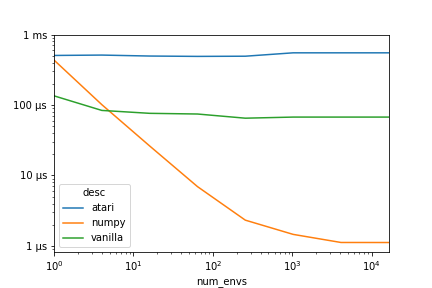

# Batched pong environment

[](https://doi.org/10.5281/zenodo.1175920)

Instead of running one environment at a time or one per thread, run everything 
in batch using numpy on a single core.

```latex
@misc{batch_pong_poc,
  author       = {Andreas Kirsch},
  title        = {Batched pong environment},
  month        = feb,
  year         = 2018,
  doi          = {10.5281/zenodo.1175920},
  url          = {https://github.com/BlackHC/batch_pong_poc/tree/master}
}
```

## Time per step per environment



*Legend*

* atari: using the gym's atari emulator
* numpy: batched Python implementation using numpy
* vanilla: simple Python implementation

Measurements against a single core with a single thread. The environment can be 
run 500x faster (compared to the Atari emulator), respectively 60x faster
(compared to a vanilla Python implementation).

## Trade-offs

Obviously, this is not equal to Atari Pong in any way but it is sufficient to
model the behavior of the game. Similar batched environments could be implemented
for Space Invaders, Catch or Sokoban. For initial experiments, such batched 
environments can provide higher throughputs while freeing compute resources
for training and inference.

The code is harder to read because of how parallel operations are specified in
numpy.
It would be nice if there was a way to use CUDA's SIMT (single instruction, 
multiple threads) model in Python.

The biggest gains are realized for very big batch sizes. Since bigger batch sizes
only reduce variance sublinearly, it would make sense to use this environment
in conjunction with Evolutionary Algorithms or Population-based Training to train
multiple models in parallel/lock-step.

## Further research

Is there a way for the vanilla batch version to be vectorized
automatically? This could work similar to CUDA's SIMT.
Could the Atari emulator be updated to execute multiple simulations in lock-step
as well. The entire state can be expressed in less than 1 KB of data, so many
simulations could be run in a cache-efficient way.
 


